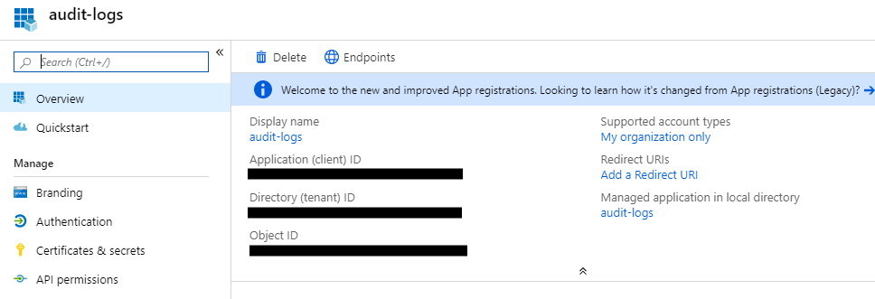
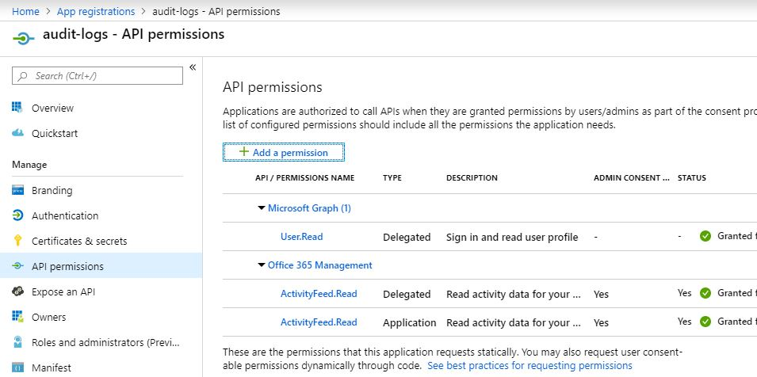

# O365beat

O365beat is an open source log shipper used to fetch Office 365 audit logs from the [Office 365 Management Activity API](https://docs.microsoft.com/en-us/office/office-365-management-api/office-365-management-activity-api-reference) and forward them with all the flexibility and capability provided by the [beats platform](https://github.com/elastic/beats) (specifically, [libbeat](https://github.com/elastic/beats/tree/master/libbeat)).

The latest release is [v1.1.0-alpha](https://github.com/counteractive/o365beat/releases/tag/v1.1.0-alpha).

## Getting Started with O365beat

The easiest way to get started with o365beat is to use the pre-built binaries available in the [latest release](https://github.com/counteractive/o365beat/releases/tag/v1.1.0-alpha).

These pre-built packages include configuration files which contain all the necessary credential information to connect to the audit logs for your tenancy.  The default configuration file ([`o365beat.yml`](./o365beat.yml)) pulls this information from your environment, like so:

```yaml
o365beat:
  # period Defines how often API is polled for new content blobs
  # 5 min default, as new content (probably) isn't published too often
  # period: 5m

  # pull secrets from environment (e.g, > set -a; . ./ENV_FILE; set +a;)
  # or hard-coded here:
  tenant_domain: ${O365BEAT_TENANT_DOMAIN:}
  client_secret: ${O365BEAT_CLIENT_SECRET:}
  client_id:     ${O365BEAT_CLIENT_ID:}     # aka application id (GUID)
  directory_id:  ${O365BEAT_DIRECTORY_ID:}  # aka tenant id (GUID)
  registry_file_path: ${O365BEAT_REGISTRY_PATH:./o365beat-registry.json}

  # the following content types will be pulled from the API
  # for available types, see https://docs.microsoft.com/en-us/office/office-365-management-api/office-365-management-activity-api-reference#working-with-the-office-365-management-activity-api
  content_types:
    - Audit.AzureActiveDirectory
    - Audit.Exchange
    - Audit.SharePoint
    - Audit.General
```

See below for more details on these values.

**NOTE:** If you decide to hard-code these values, be sure to replace the `${:}` syntax, which [pulls from the environment](https://www.elastic.co/guide/en/beats/libbeat/current/config-file-format-env-vars.html).  For example, use `tenant_domain: acme.onmicrosoft.com` *not* `tenant_domain: ${acme.onmicrosoft.com:}`.

### Prerequisites and Permissions

O365beat requires access to the Office 365 Management APIs for your tenancy.  Instructions for getting this set up are available in the [Microsoft documentation](https://docs.microsoft.com/en-us/office/office-365-management-api/get-started-with-office-365-management-apis#register-your-application-in-azure-ad)

Once you have this set up, you'll be able to get the information needed in the config file.  One tricky thing is dealing with the odd naming conventions.  If you look in `o365beat.yml` you’ll see some of the synonyms: client id is also called the application id, and the directory id is also called the tenant id.  In the Azure portal, go to "App registrations" and you’ll see the Application (Client) ID – a GUID – right there in the application list.  If you click on that you’ll see the application (client) id and the directory (tenant) id in the top area.



The client secret is a little trickier, you can create them by clicking the "Certificates & secrets" link on the left there.  Be sure to copy it somewhere or you’ll have to create a new one … there’s no facility for viewing them later.  The [default config file](./o365beat.yml) expect these config values to be in your environment (i.e., as environment variables), named O365BEAT_TENANT_DOMAIN, O365BEAT_CLIENT_SECRET, etc.  You can hard-code them in that file if you like, especially when testing, just be smart about the permissions.

Finally, the azure app registration permissions should look like this:



You can edit those using that “API permissions” link on the left, with [more detailed instructions available from Microsoft](https://docs.microsoft.com/en-us/office/office-365-management-api/get-started-with-office-365-management-apis#specify-the-permissions-your-app-requires-to-access-the-office-365-management-apis).  The beat should automatically subscribe you to the right feeds, though that functionality is currently undergoing testing.

### Run

To run O365beat with all debugging output enabled, run:

```bash
./o365beat --path.config . -c o365beat.yml -e -d "*" # add --strict.perms=false under WSL 1
```

**NOTE:** By default o365beat doesn't know where to look for its configuration so you have to specify that explicitly.  If you see errors authenticating it may be the beat's not seeing your config.  Future versions will have more helpful error messages in this regard.

### Receive with Logstash

If you're receiving o365beat logs with [logstash](https://www.elastic.co/products/logstash), use the input type `beats`:

```ruby
input {
  beats {
    port => "5044"
  }
}
```

### Schema

As of [v1.2.0](https://github.com/counteractive/o365beat/releases/tag/v1.2.0), o365beat includes a [processor](https://github.com/elastic/beats/blob/master/libbeat/docs/processors-using.asciidoc#convert) to map the raw API-provided events to Elastic Common Schema ([ECS](https://www.elastic.co/guide/en/ecs/current/index.html)) fields.  This allows this beat to work with standard Kibana dashboards, including capabilities in [Elastic SIEM](https://www.elastic.co/products/siem).

Implementing this as a processor means you can disable it if you don't use the ECS functionality, or change from "copy" to "rename" if you _only_ use ECS.  We may end up adding some ECS stuff in the "core" of the beat as well, but this is a decent start.

See the [Office 365 Management API schema documentation](https://docs.microsoft.com/en-us/office/office-365-management-api/office-365-management-activity-api-schema) for details on the raw events.  The ECS mapping is as follows (excerpt from [`o365beat.yml`](./o365beat.yml)):

```yaml
# from: https://docs.microsoft.com/en-us/office/office-365-management-api/office-365-management-activity-api-schema
# to: https://www.elastic.co/guide/en/ecs/current/ecs-client.html

processors:
  - convert:
      fields:
        - {from: "Id", to: "event.id", type: string}                # ecs core
        - {from: "RecordType", to: "event.code", type: string}      # ecs extended
        # - {from: "CreationTime", to: "", type: ""}                # @timestamp
        - {from: "Operation", to: "event.action", type: string}     # ecs core
        - {from: "OrganizationId", to: "cloud.account.id", type: string} # ecs extended
        # - {from: "UserType", to: "", type: ""}                    # no ecs mapping
        # - {from: "UserKey", to: "", type: ""}                     # no ecs mapping
        - {from: "Workload", to: "event.category", type: string}    # ecs core
        - {from: "ResultStatus", to: "event.outcome", type: string} # ecs extended
        # - {from: "ObjectId", to: "", type: ""}                    # no ecs mapping
        - {from: "UserId", to: "user.id", type: string}             # ecs core
        - {from: "ClientIP", to: "client.ip", type: ip}             # ecs core
        # - {from: "Scope", to: "", type: ""}                       # no ecs mapping
```

Please open an issue or a pull request if you have suggested improvements to this approach.

*If you'd like to build yourself, read on.*

### Build Requirements

* [Golang](https://golang.org/dl/) 1.7

### Build

To build the binary for O365beat run the command below. This will grab vendor dependencies if you don't have them already, and generate a binary in the same directory with the name o365beat.

```bash
make
```

### Test (none so far!)

To test O365beat, run the following command:

```bash
make testsuite
```

alternatively:

```bash
make unit-tests
make system-tests
make integration-tests
make coverage-report
```

The test coverage is reported in the folder `./build/coverage/`

### Update

Each beat has a template for the mapping in elasticsearch and a documentation for the fields
which is automatically generated based on `fields.yml` by running the following command.

```bash
make update
```

### Cleanup

To clean  O365beat source code, run the following command:

```bash
make fmt
```

To clean up the build directory and generated artifacts, run:

```bash
make clean
```

### Clone

To clone O365beat from the git repository, run the following commands:

```bash
mkdir -p ${GOPATH}/src/github.com/counteractive/o365beat
git clone https://github.com/counteractive/o365beat ${GOPATH}/src/github.com/counteractive/o365beat
```

For further development, check out the [beat developer guide](https://www.elastic.co/guide/en/beats/libbeat/current/new-beat.html).

## Packaging

The beat frameworks provides tools to cross-compile and package your beat for different platforms. This requires [docker](https://www.docker.com/) and vendor-ing as described above. To build packages of your beat, run the following command:

```bash
make release
```

This will fetch and create all images required for the build process. The whole process to finish can take several minutes.

## Tasks

* [ ] Tests
* [ ] Update underlying libbeat to 7.3.x (currently 7.2.x)
* [ ] ECS field mappings beyond the API's [common schema](https://docs.microsoft.com/en-us/office/office-365-management-api/office-365-management-activity-api-schema#common-schema)
* [x] ECS field mappings for API's [common schema](https://docs.microsoft.com/en-us/office/office-365-management-api/office-365-management-activity-api-schema#common-schema)
