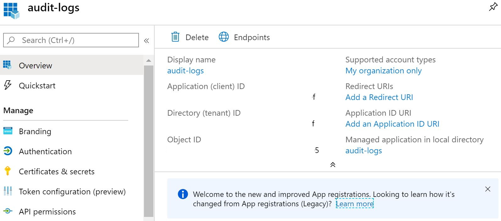
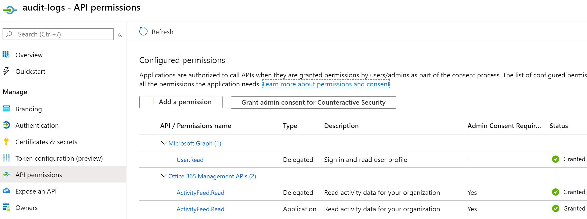

# O365beat

O365beat is an open source log shipper used to fetch Office 365 audit logs from the [Office 365 Management Activity API](https://docs.microsoft.com/en-us/office/office-365-management-api/office-365-management-activity-api-reference) and forward them with all the flexibility and capability provided by the [beats platform](https://github.com/elastic/beats) (specifically, [libbeat](https://github.com/elastic/beats/tree/master/libbeat)).

**The latest release is [v1.5.1](https://github.com/counteractive/o365beat/releases/latest)**.  This release:

* Added support for the [`script` processor](https://www.elastic.co/guide/en/beats/filebeat/current/processor-script.html) and provided a sample processor script to convert fields that contain arrays of name-value pairs into a "normal" object (closes #41)
* Updated README and config files to highlight options to help avoid timeouts on busy tenancies (closes #39)
* Updated README to link to references on API event data (closes #37)

**Thank you so much to the users who reached out with issues, including feature requests.**  Please continue to help us and the community by opening issues or submitting pull requests if you notice problems in testing or production, or if there are features you'd like to see. We appreciate the feedback!

## Getting Started with o365beat

The easiest way to get started with o365beat is to use the pre-built binaries available in the [latest release](https://github.com/counteractive/o365beat/releases/latest/).

These pre-built packages include configuration files which contain all the necessary credential information to connect to the audit logs for your tenancy.  The default configuration file ([`o365beat.yml`](./_meta/beat.yml)) pulls this information from your environment or beats keystores (see [this issue](https://github.com/counteractive/o365beat/issues/11) or the [filebeat docs](https://www.elastic.co/guide/en/beats/filebeat/current/keystore.html)), like so:

```yaml
o365beat:
  # pull secrets from environment (e.g, > set -a; . ./ENV_FILE; set +a;)
  # or a key store (https://www.elastic.co/guide/en/beats/filebeat/current/keystore.html)
  # or hard-code here:
  tenant_domain: ${O365BEAT_TENANT_DOMAIN:}
  client_secret: ${O365BEAT_CLIENT_SECRET:}
  client_id:     ${O365BEAT_CLIENT_ID:}     # aka application id (GUID)
  directory_id:  ${O365BEAT_DIRECTORY_ID:}  # aka tenant id (GUID)
  registry_file_path: ${O365BEAT_REGISTRY_PATH:./o365beat.state}

  # the following content types will be pulled from the API
  # for available types, see https://docs.microsoft.com/en-us/office/office-365-management-api/office-365-management-activity-api-reference#working-with-the-office-365-management-activity-api
  content_types:
    - Audit.AzureActiveDirectory
    - Audit.Exchange
    - Audit.SharePoint
    - Audit.General
```

**NOTE 1: In pre-packaged releases before v1.5.0, the packaged config file contains an additional `processors` section that gets merged into the o365beat.yml and shadows the custom processors used by this beat. You must manually remove the second `processors` section, or merge the two, to avoid problems.**  This is due to a quirk in the libbeat build system which was fixed in release v1.5.0.

Again, **v1.5.0 packages (and later) do not exhibit this issue,** but if you retain your old configuration files you may still have the problematic `processors` section.  Please see [this issue](https://github.com/counteractive/o365beat/issues/9) for more information on how to fix it.

**NOTE 2:** If you decide to hard-code your configuration values, be sure to replace the `${:}` syntax, which [pulls from the environment](https://www.elastic.co/guide/en/beats/libbeat/current/config-file-format-env-vars.html).  For example, use `tenant_domain: acme.onmicrosoft.com` *not* `tenant_domain: ${acme.onmicrosoft.com:}`.

### Prerequisites and Permissions

O365beat requires that you [**enable audit log search**](https://docs.microsoft.com/en-us/microsoft-365/compliance/turn-audit-log-search-on-or-off#turn-on-audit-log-search) for your Office 365 tenancy, done through the Security and Compliance Center in the Office 365 Admin Portal.  If you want detailed Exchange events, you also have to [**enable mailbox auditing**](https://docs.microsoft.com/en-us/microsoft-365/compliance/enable-mailbox-auditing) (on by default since January 2019, but worth checking).

It also needs access to the Office 365 Management API: instructions for setting this up are available in the [Microsoft documentation](https://docs.microsoft.com/en-us/office/office-365-management-api/get-started-with-office-365-management-apis#register-your-application-in-azure-ad).

Once you have these set up, you'll be able to get the information needed in the config file.  The naming conventions for the settings are a bit odd, in `o365beat.yml` you’ll see some of the synonyms: client id is also called the application id, and the directory id is also called the tenant id.  In the Azure portal, go to "App registrations" and you’ll see the Application (Client) ID – a GUID – right there in the application list.  If you click on that you’ll see the application (client) id and the directory (tenant) id in the top area.



The client secret is a little trickier, you can create them by clicking the "Certificates & secrets" link on the left there.  Be sure to copy it somewhere or you’ll have to create a new one … there’s no facility for viewing them later.  The [default config file](./o365beat.yml) expects these config values to be in your environment (i.e., as environment variables) or in a [keystore](https://www.elastic.co/guide/en/beats/filebeat/current/keystore.html), named O365BEAT_TENANT_DOMAIN, O365BEAT_CLIENT_SECRET, etc.  You can hard-code them in that file if you like, especially when testing, just be smart about the permissions.

Finally, the Azure app registration permissions should look like this:



You can edit those using that “API permissions” link on the left, with [more detailed instructions available from Microsoft](https://docs.microsoft.com/en-us/office/office-365-management-api/get-started-with-office-365-management-apis#specify-the-permissions-your-app-requires-to-access-the-office-365-management-apis).  The beat should automatically subscribe you to the right feeds, though that functionality is currently undergoing testing.

### Run

To run O365beat with all debugging output enabled, run:

```bash
./o365beat --path.config . -c o365beat.yml -e -d "*" # add --strict.perms=false under WSL 1
```

State is maintained in the `registry_file_path` location, by default in the working directory as `o365beat.state`.  This file currently contains only a timestamp representing the creation date of the last content blob retrieved, to prevent repeat downloads.

**NOTE:** Unless it's installed, o365beat doesn't know where to look for its configuration so you have to specify that explicitly.  If you see errors authenticating it may be the beat's not seeing your config.  Future versions will have more helpful error messages in this regard.

### Receive with Logstash

If you're receiving o365beat logs with [logstash](https://www.elastic.co/products/logstash), use the input type `beats`:

```ruby
input {
  beats {
    port => "5044"
  }
}
```

### Schema

As of v1.2.0, o365beat includes a [processor](https://github.com/elastic/beats/blob/master/libbeat/docs/processors-using.asciidoc#convert) to map the raw API-provided events to Elastic Common Schema ([ECS](https://www.elastic.co/guide/en/ecs/current/index.html)) fields.  This allows this beat to work with standard Kibana dashboards, including capabilities in [Elastic SIEM](https://www.elastic.co/products/siem).  Updates in v1.4.0 and v1.4.1 corrected some parsing issues and included at least one more ECS field.

Implementing this as a processor means you can disable it if you don't use the ECS functionality, or change from "copy" to "rename" if you _only_ use ECS.  We may end up adding some ECS stuff in the "core" of the beat as well, but this is a decent start.  These processors are critical for the proper functioning of the beat and its visualizations.  Disabling or modifying them can lead to dropped events or other issues.  **Please update with caution.**

See the [Office 365 Management API schema documentation](https://docs.microsoft.com/en-us/office/office-365-management-api/office-365-management-activity-api-schema) for details on the raw events.  The ECS mapping is as follows (excerpt from [`o365beat.yml`](./_meta/beat.yml)):

```yaml
# from: https://docs.microsoft.com/en-us/office/office-365-management-api/office-365-management-activity-api-schema
# to: https://www.elastic.co/guide/en/ecs/current/ecs-client.html

processors:
  - convert:
      fields:
        - {from: Id, to: 'event.id', type: string}                # ecs core
        - {from: RecordType, to: 'event.code', type: string}      # ecs extended
        - {from: Operation, to: 'event.action', type: string}     # ecs core
        - {from: OrganizationId, to: 'cloud.account.id', type: string} # ecs extended
        - {from: Workload, to: 'event.category', type: string}    # ecs core
        - {from: ResultStatus, to: 'event.outcome', type: string} # ecs extended
        - {from: UserId, to: 'user.id', type: string}             # ecs core
        - {from: ClientIP, to: 'client.ip', type: ip}             # ecs core
        - {from: 'dissect.clientip', to: 'client.ip', type: ip}   # ecs core
        - {from: Severity, to: 'event.severity', type: string}    # ecs core
        # the following fields use the challenging array-of-name-value-pairs format
        # converting them to strings fixes issues in elastic, eases non-script parsing
        # easier to rehydrate into arrays from strings than vice versa:
        - {from: Parameters, type: string}                        # no ecs mapping
        - {from: ExtendedProperties, type: string}                # no ecs mapping
        - {from: ModifiedProperties, type: string}                # no ecs mapping
```

Please open an issue or a pull request if you have suggested improvements to this approach.

## Frequently Asked Questions (FAQ)

* **Why can't I see events from Exchange (or some other source)?**

  1. Confirm all the content types are listed under the `content_types` key in `o365beat.yml`, like so:
      ```yaml
      content_types:
        - Audit.AzureActiveDirectory
        - Audit.Exchange
        - Audit.SharePoint
        - Audit.General
        ```
  2. Confirm [audit log search](https://docs.microsoft.com/en-us/microsoft-365/compliance/turn-audit-log-search-on-or-off#turn-on-audit-log-search) is enabled for your tenancy.
  3. Many exchange events require mailbox auditing to be enabled.  Confirm [mailbox auditing is enabled](https://docs.microsoft.com/en-us/microsoft-365/compliance/enable-mailbox-auditing).
  4. Some audit events take time to create.  If this is a test tenancy, or if you just enabled new audit subscriptions, it can take [up to 12 hours](https://docs.microsoft.com/en-us/office/office-365-management-api/office-365-management-activity-api-reference#working-with-the-office-365-management-activity-api) for all the data to start showing up in the results.
  5. Check the logs created by o365beat for any errors.  You can do this by running it at the command line with all debugging enabled: `./o365beat --path.config . -c o365beat.yml -e -d "*"`

* **Why can't I see the ECS fields like `client.ip` in my events?**

  Due to a quirk in the libbeat build system, the default config file contains an additional `processors` section that gets merged into the `o365beat.yml` and shadows the custom processors used by this beat. You must manually remove the second `processors` section (the one that contains `add_host_metadata` and `add_cloud_metadata`, neither of which is particularly useful), or merge the two, to avoid problems. Please see [this issue](https://github.com/counteractive/o365beat/issues/9) for more information, we're working on a durable fix.

* **I'm seeing `non-200` errors in my debugging output for some API calls, am I getting all events?**

  Please update to release [v1.4.3](https://github.com/counteractive/o365beat/releases/tag/v1.4.3) or later.  There were a few cases where the `PublisherIdentifier` was not appended to requests, which could cause API throttling in certain cases, which has now been fixed.

* **Can I use this beat with [GCC High endpoints](https://docs.microsoft.com/en-us/office365/enterprise/office-365-u-s-government-gcc-high-endpoints), or other non-standard Office 365 deployments?**

  Yes! As of version 1.5.0, the beat pulls Login URL and Resource URL values from the config file.  The default values work for typical Office 365 situations, but you can connect to [GCC High endpoints](https://docs.microsoft.com/en-us/office365/enterprise/office-365-u-s-government-gcc-high-endpoints) by modifying the following keys:
    ```yaml
    o365beat:
      login_url: login.microsoftonline.us  # default is login.microsoftonline.com
      resource_url: manage.office365.us    # default is manage.office.com
      # rest of your config ...
    ```

* **Why am I getting timeout errors when retrieving certain content types?**

  For busy tenants or certain networking environments the default `api_timeout` of 30 seconds might be insufficient.  You can extend this in `o365beat.yml`.  Additionally, you can minimize risk of timeouts by reducing the `content_max_age` setting (default 7 days, or 168 hours) to something like 1 day (`1d`) or a few hours (say, `5h`).  Generally this will only impact you on the first time you run the beat, as every request thereafter will only be requesting data for the preceding `period` (default, 5 minutes).  See [this issue](https://github.com/counteractive/o365beat/issues/39) for additional discussion.

* **Can I parse event fields like `ExtendedProperties` and `Parameters` that contain arrays of name-value pairs on the client side before shipping them?**

  As of version 1.5.1, the beat imports the [`script` processor](https://www.elastic.co/guide/en/beats/filebeat/current/processor-script.html) and provides a sample processor script in `o365beat.reference.yml` to convert fields that contain arrays of name-value pairs into a "normal" object. See [this issue](https://github.com/counteractive/o365beat/issues/41) for more discussion.

* **Why are the authentication events (especially logon failures and errors) so confusing?**

  Please see [this issue](https://github.com/counteractive/o365beat/issues/37) for an in-depth discussion of some of the idiosyncrasies of the audit log events themselves.  This beat just ships them, Microsoft makes decisions about what's in them.

* **I don't see my problem listed here, what gives?**

  Please review this full README and the [issues list](https://github.com/counteractive/o365beat/issues), and submit a new issue if you can't find a solution.  And you can always [contact us](https://www.counteractive.net/contact/) for assistance. Thanks!

*If you'd like to build yourself, read on.*

## Build Process

### Build Requirements

* [Golang](https://golang.org/dl/) 1.7

### Build

To build the binary for O365beat run the command below. This will grab vendor dependencies if you don't have them already, and generate a binary in the same directory with the name o365beat.

```bash
make
```

### Test (none so far!)

To test O365beat, run the following command:

```bash
make testsuite
```

alternatively:

```bash
make unit-tests
make system-tests
make integration-tests
make coverage-report
```

The test coverage is reported in the folder `./build/coverage/`

### Update

Each beat has a template for the mapping in elasticsearch and a documentation for the fields
which is automatically generated based on `fields.yml` by running the following command.

```bash
make update
```

### Cleanup

To clean o365beat source code, run the following command:

```bash
make fmt
```

To clean up the build directory and generated artifacts, run:

```bash
make clean
```

### Clone

To clone o365beat from the git repository, run the following commands:

```bash
mkdir -p ${GOPATH}/src/github.com/counteractive/o365beat
git clone https://github.com/counteractive/o365beat ${GOPATH}/src/github.com/counteractive/o365beat
```

For further development, check out the [beat developer guide](https://www.elastic.co/guide/en/beats/libbeat/current/new-beat.html).

## Packaging

The beat frameworks provides tools to cross-compile and package your beat for different platforms. This requires [docker](https://www.docker.com/) and vendor-ing as described above. To build packages of your beat, run the following command:

```bash
make release
```

Be sure you have python, virtualenv, gcc, and docker installed, and that the user you're using to build the release is in the `docker` group (if not, it'll just hang with no helpful error message).

This will fetch and create all images required for the build process. The whole process to finish can take several minutes.

## Tasks

* [ ] Support multiple tenancies with a single beat instance
* [ ] Support client certificates (in addition to client secrets)
* [ ] Tests
* [ ] ECS field mappings beyond the API's [common schema](https://docs.microsoft.com/en-us/office/office-365-management-api/office-365-management-activity-api-schema#common-schema)
* [x] Add visualizations and dashboard
* [x] ECS field mappings for API's [common schema](https://docs.microsoft.com/en-us/office/office-365-management-api/office-365-management-activity-api-schema#common-schema)

## Changelog

* v1.5.1 - Added support for the `script` processor (to fix #41), updated README and config files to highlight options to help avoid timeouts (#39), updated README to link to references on API event data (#37)
* v1.5.0 - Added and documented feature to customize API endpoints (#25), updates libbeat to v7.5.1, properly parses certain `ClientIP` field formats (#16, #31), fixes build issue that caused important processors to be shadowed in config (#9), fixes issue parsing corrupted state/registry files (#19).
* v1.4.3 - Fixed bugs related to throttling and troubleshooting (closes issues #17 and #21)
* v1.4.2 - Fixed multiple processor bugs (closes issues #12, #13, and #14)
* v1.4.1 - Added kibana visualizations and dashboard and updated processors to better handle fields containing data arrays
* v1.4.0 - Bumped libbeat to v7.4.0 and fixed throttling issue
* v1.3.1 - Updated documentation and improved error messages
* v1.3.0 - Fixed auto-subscribe logic and updated documentation
* v1.2.0 - Initial production release
